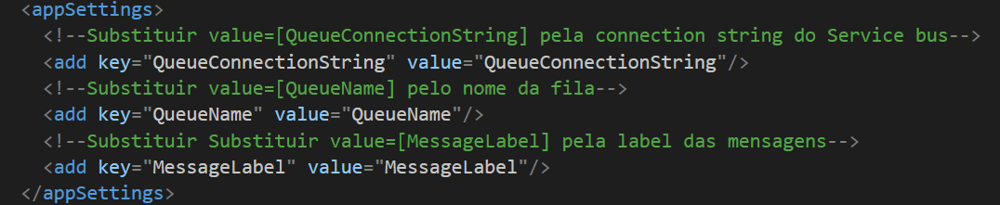

# Deadletter Resender

Console application desenvovida em .NET Framework para remover mensagens da [dead letter](https://docs.microsoft.com/en-us/azure/service-bus-messaging/service-bus-dead-letter-queues) e encaminhá-las a [queue](https://docs.microsoft.com/en-us/azure/service-bus-messaging/service-bus-queues-topics-subscriptions) do [Service bus](https://docs.microsoft.com/en-us/azure/service-bus-messaging/service-bus-messaging-overview) novamente.

## Configurações para execução

Edite o arquivo [App.config](DeadLetterResender/App.config) e substitua os valores das keys:

- QueueConnectionString
- QueueName
- [MessageLabel](https://docs.microsoft.com/en-us/dotnet/api/microsoft.azure.servicebus.message.label?view=azure-dotnet)

Abaixo está a seção AppSettings do App.config onde os valores devem ser alterados.

Observação: Caso os valores não sejam alterados a aplicação não funcionará corretamente.

## Arquivos de log

Dois arquivos de log são criados no diretório bin/Debug, estes arquivos servem para consulta de quais mensagens foram e não foram processadas corretamente. 

O arquivo de log das mensagens enviadas com sucesso é criado com o nome deadletter-[ticks](https://docs.microsoft.com/en-us/dotnet/api/system.datetime.ticks?view=netframework-4.8)-log.json para que o conteúdo das mensagens possa ser analisado caso necessário.

As mensagens que não foram enviadas corretamente por algum motivo podem ser encontradas no arquivo deadletter-errors-[ticks](https://docs.microsoft.com/en-us/dotnet/api/system.datetime.ticks?view=netframework-4.8)-log.txt, este arquivo possui o motivo da mensagem não ter sido processada corretamente e o id da mensagem na queue.
